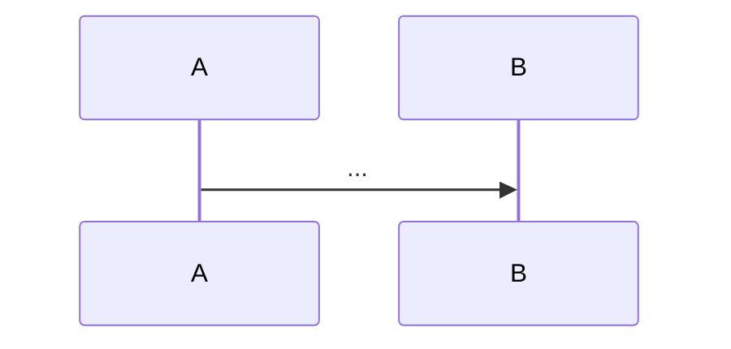

# Code Review — Reference

Detailed reference for the `/ro:code-review` skill. SKILL.md is the playbook; this is the lookup table.

Source pattern: [[coderabbit-style-pr-review]] in `llm-wiki-skill-lab/wiki/patterns/`. Keep this file in sync if the pattern note changes.

## Severity taxonomy (full)

| Level | Emoji | Inline label | When to use | GH event |
|-------|-------|--------------|-------------|----------|
| **critical** | ⚠️ | `_⚠️ Critical (blocking)_` | Real bug, security flaw, broken public contract, data corruption, undeployable code. Must fix before merge. | `REQUEST_CHANGES` |
| **major** | 🛠️ | `_🛠️ Major suggestion_` | Design concern, missing test coverage on critical path, performance footgun, unclear naming on a public API. Author should address or push back with reasoning. | `COMMENT` (or `REQUEST_CHANGES` with `--profile strict`) |
| **minor** | 🧹 | `_🧹 Nitpick (non-blocking)_` | Polish, naming, micro-refactor. Suppressed unless `--assertive`. Max 5 per review. | `COMMENT` |
| **question** | ❓ | `_❓ Question_` | Clarification request. Don't assert a problem; just ask. | `COMMENT` |
| **praise** | ✨ | `_✨ Praise_` | Sincere recognition of a non-obvious good choice. Max 1 per review. | `COMMENT` |

Verdict resolution:
- Has any critical → `REQUEST_CHANGES`
- `--profile strict` AND any major → `REQUEST_CHANGES`
- `--profile chill` AND zero critical → `APPROVE`
- Otherwise → `COMMENT`

## Comment templates

### Critical (blocking) — inline

```
**🤖 RoBot review** — _⚠️ Critical (blocking)_

**<one-line subject>**

<one paragraph: WHY this matters. State the failure mode in concrete terms — what input triggers it, what breaks. No vague "this could cause issues".>

```suggestion
<exact replacement code>
```

<!-- robot-review:inline -->
```

### Major suggestion — inline

```
**🤖 RoBot review** — _🛠️ Major suggestion_

**<one-line subject>**

<one paragraph: the concern + the alternative you're suggesting. Make it actionable; don't say "consider refactoring" without saying what to.>

```suggestion
<replacement, if applicable>
```

<!-- robot-review:inline -->
```

### Nitpick — inline (only with --assertive)

```
**🤖 RoBot review** — _🧹 Nitpick (non-blocking)_

**<one-line subject>**

<one sentence. Nits are short. If you can't make the case in one sentence, it's not a nit.>

<!-- robot-review:inline -->
```

### Question — inline

```
**🤖 RoBot review** — _❓ Question_

**<the question, phrased neutrally>**

<one short paragraph of context if needed. Don't lead the witness — ask the question, share the context, let the author decide.>

<!-- robot-review:inline -->
```

### Praise — inline

```
**🤖 RoBot review** — _✨ Praise_

**<what specifically is good>**

<one sentence on why this choice was non-obvious or notable. No generic "great job".>

<!-- robot-review:inline -->
```

## Walkthrough template

```markdown
**🤖 RoBot review** — kind, direct, opinionated. [reference][1]

<!-- robot-review:start sha=<HEAD_SHA> profile=<profile> -->

## Walkthrough

<one paragraph in plain English: what the PR sets out to do and the shape of how it does it. Not a file enumeration. If the PR's intent isn't legible from the diff alone, say so.>

## Changes

| File | Change |
|------|--------|
| `path/to/file.ts` | Adds X to do Y |
| `path/to/other.ts` | Refactors Z |

## Estimated review effort

<1-5> / 5 — <one-line justification>

## Findings

- 🔴 **Critical:** <N>
- 🟠 **Major:** <N>
- 🟡 **Minor:** <N>  <!-- "suppressed; use --assertive" if N > 0 and not assertive -->
- 🔵 **Questions:** <N>
- 🟢 **Praise:** <N>

## Sequence diagram

<only if the PR touches multi-component interactions>



## Out of scope

<observations that fall outside the diff. Don't post these inline — GH would reject the comment for being on unchanged lines.>

- `legacy/auth.ts` has the same null-check pattern; might be worth a follow-up.
- The `retries` config in `wrangler.toml` defaults to 3; not touched here but worth knowing.

## Poem

<only if --poem. Four lines. Rabbit optional. Keep it tied to the actual PR content.>

<!-- robot-review:end -->

[1]: <PR URL> "Generated by /ro:code-review (Claude Opus 4.7)"
```

## Local report template

Path: `./.code-review/PR-<N>-<slug>.md`

```markdown
# Code Review: <PR title>

| Field | Value |
|-------|-------|
| PR | [#<N>](<PR URL>) |
| Author | <login> |
| Branch | `<head>` → `<base>` |
| Head SHA | `<short-sha>` |
| Reviewer | /ro:code-review (Claude Opus 4.7) |
| Date | <YYYY-MM-DD> |
| Profile | <standard\|strict\|chill> |
| Verdict | <comment\|request-changes\|approve> |

## Summary

<one paragraph: intent, not diff restating>

## Stats

| Metric | Count |
|--------|-------|
| Critical | <N> |
| Major | <N> |
| Minor / nitpicks | <N> |
| Questions | <N> |
| Praise | <N> |
| Files changed | <N> |
| Lines added | +<N> |
| Lines removed | -<N> |
| Estimated review effort | <1-5>/5 |

## Critical (must-fix before merge)

### 1. <subject> — `path/to/file.ts:42`

**Issue.** <WHY in concrete terms>

**Fix.**

```diff
- bad line
+ good line
```

## Major

### 1. <subject> — `path/to/file.ts:88`

**Concern.** ...

**Suggestion.**

```diff
...
```

## Minor / nitpicks

- `src/util.ts:14` — extract magic number `3600` to `ONE_HOUR_SECONDS`
- `src/auth.ts:90` — rename `tmp` to something semantic

## Questions for the author

- `src/cache.ts:14` — is the 60s TTL deliberate? Rest of cache layer uses 300s.
- `src/api.ts:200` — does this need to handle the rate-limit response, or is upstream handling that?

## Praise

- `src/db/migrations/0042.sql` — the down-migration is non-trivial and you wrote it; many people skip that.

## Sequence diagram

<mermaid if applicable>

## Out of scope

- ...
```

## GitHub API JSON shape (full)

```json
{
  "commit_id": "<HEAD_SHA>",
  "event": "COMMENT",
  "body": "<full walkthrough markdown>",
  "comments": [
    {
      "path": "src/auth.ts",
      "line": 42,
      "side": "RIGHT",
      "body": "**🤖 RoBot review** — _⚠️ Critical (blocking)_\n\n**Missing null check on user**\n\n..."
    },
    {
      "path": "src/db/users.ts",
      "start_line": 60,
      "start_side": "RIGHT",
      "line": 64,
      "side": "RIGHT",
      "body": "..."
    }
  ]
}
```

Field reference:
- `commit_id` — must be HEAD of the PR branch. Get via `gh pr view <N> --json headRefOid -q .headRefOid`.
- `event` — `COMMENT` | `APPROVE` | `REQUEST_CHANGES` | `PENDING` (omit `event` to leave pending).
- `body` — top-level walkthrough markdown.
- `comments[].path` — must be a file in the PR diff.
- `comments[].line` — file line (1-indexed). For a single-line comment, this is the line being commented on.
- `comments[].side` — `RIGHT` for added/context, `LEFT` for removed.
- Multi-line: include `start_line` AND `start_side`. `start_line` ≤ `line`. Both `start_side` and `side` are required.

Commands:

```bash
# Post a review (atomic, with inline comments + walkthrough)
gh api repos/<OWNER>/<REPO>/pulls/<N>/reviews \
  --method POST \
  --input /tmp/robot-review-<N>.json

# Find an existing RoBot review to dismiss
gh api repos/<OWNER>/<REPO>/pulls/<N>/reviews \
  --jq '.[] | select(.body | contains("robot-review:start")) | .id'

# Dismiss a stale review
gh api repos/<OWNER>/<REPO>/pulls/<N>/reviews/<REVIEW_ID>/dismissals \
  --method PUT \
  -f message="Superseded by re-run of /ro:code-review"

# Delete a previous walkthrough issue comment (if posted separately)
gh api repos/<OWNER>/<REPO>/pulls/<N>/comments | \
  jq '.[] | select(.body | contains("robot-review:start")) | .id'
```

## Suggestion block rules

GitHub renders the "Commit suggestion" button only when:
1. The comment is on the exact lines the suggestion replaces.
2. The fenced block is exactly ` ```suggestion ` (no language modifier).
3. The suggestion contents replace ALL of the targeted lines (don't include unchanged lines around it).

For multi-line suggestions, target the full range with `start_line` + `line` and the suggestion block replaces all of it.

If the suggestion itself contains triple-backticks (e.g., suggesting a markdown change), wrap with 5 backticks instead:

```
`````suggestion
some code with ```triple ticks``` inside
`````
```

## Anti-patterns to avoid (full)

1. **Hallucinated line numbers.** Validate every `path:line` against the parsed diff before emitting. Reject any finding whose line isn't in a hunk.
2. **Commenting on unchanged lines.** GitHub rejects with 422. Out-of-diff observations go in the walkthrough `## Out of scope` section.
3. **Restating the diff.** "This PR adds X to file Y and modifies Z..." is zero-value. Summary captures INTENT, not file enumeration.
4. **Low-signal generics.** "Consider extracting", "add error handling", "improve readability" without naming the specific extraction / error / readability win are noise.
5. **Nit-flood drowning real issues.** Cap nits at 5. Suppress entirely without `--assertive`.
6. **Sycophantic praise.** "Great work!" on every PR trains the author to skim. One sincere praise per real win.
7. **Backpedalling.** If confident, stand by it. If not confident, don't post it.
8. **Style nits a linter catches.** Out of scope. Spacing, semicolons, quotes, import order.
9. **Hallucinated APIs.** Check the actual import scope and runtime targets before recommending APIs ("use Array.prototype.findLast" when Node 14 is the target).
10. **Missing the real bug while flagging style.** Read for correctness FIRST (race, off-by-one, error paths, security), THEN polish.

## Tone calibration

The voice is **kind, direct, opinionated**. Pattern from Google eng-practices:

- ❌ Bad: "Why did **you** use threads here when there's obviously no benefit?"
- ✅ Good: "The concurrency model here is adding complexity to the system without any actual performance benefit that I can see..."

Address the code, not the person. Don't apologise for flagging things. Don't shame.

Sentence shape per inline finding:
1. **Subject** — what the thing is, in one bold line.
2. **WHY** — one paragraph on the failure mode or design concern in concrete terms.
3. **Fix** — a suggestion block or diff.

No fluff at the end ("happy to discuss!", "great PR otherwise!"). The walkthrough handles overall framing.

## Sources

- [[coderabbit-style-pr-review]] — the source pattern in the wiki
- https://docs.coderabbit.ai/pr-reviews/walkthroughs
- https://github.com/makeplane/plane/pull/6445 (real CodeRabbit example)
- https://conventionalcomments.org/
- https://google.github.io/eng-practices/review/reviewer/comments.html
- https://docs.github.com/en/rest/pulls/reviews
- https://docs.github.com/en/rest/pulls/comments
