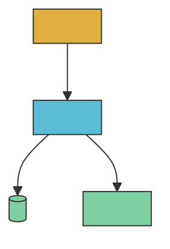
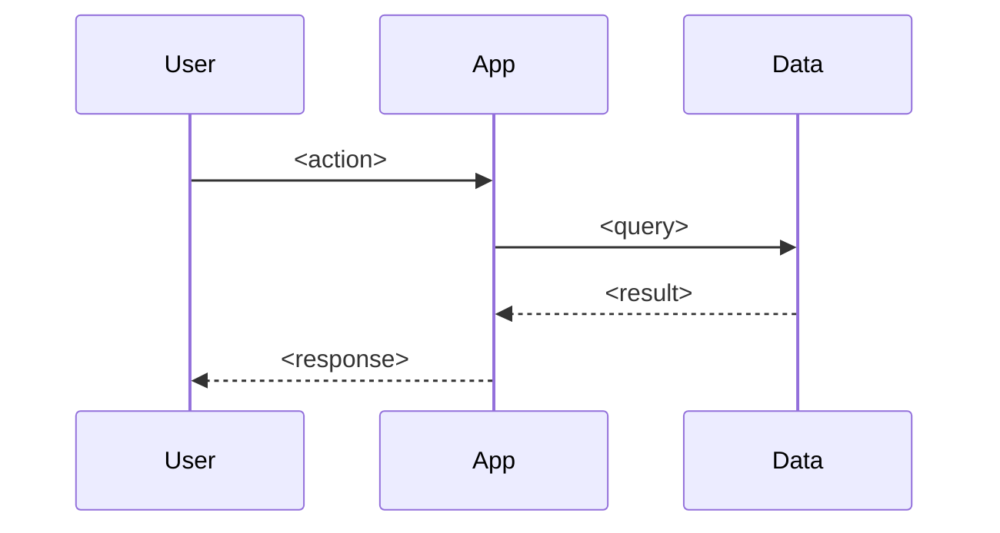

# Generate Spec

Produces a single `spec.md` per generation, versioned by date and mode. The spec is the executable contract: stories use EARS format, decisions are inline ADRs, and the plan slots straight into `/ralph`.

Sister skills: `/compare-specs` (diff two specs) and `/compare-codebase-to-spec` (drift audit). Render to PDF via the llm-wiki `/generate pdf` skill.

## Lifecycle: vault genesis → repo graduation

Specs go through three phases. Storage moves with the phase.

| Phase | Where the spec lives | Status field | Trigger |
|---|---|---|---|
| 1. Genesis | Vault: `vaults/llm-wiki-<vault>/wiki/specs/<name>-spec-v1-fresh-YYYY-MM-DD.md` | `draft` then `accepted` | `/generate-spec --mode fresh --vault <name> <project>` |
| 2. Graduation | Repo: `docs/specs/spec-v1-fresh-YYYY-MM-DD.md` (copy of vault canonical) | vault entry: `graduated-to-repo`, repo entry: `accepted` | Repo scaffolded from spec; copy + cross-link both sides |
| 3. Living spec | Repo: `docs/specs/spec-v<N>-from-codebase-YYYY-MM-DD.md` | each version: `draft` → `accepted` → `superseded` | `/generate-spec --mode from-codebase` after each phase ships |

A spec born inside an existing repo (no vault step) jumps straight to phase 3 storage.

## Usage

```
# Phase 1, vault genesis (no repo yet)
/generate-spec --mode fresh --vault <vault-short> <name>

# Phase 3, in an existing repo (cwd is the repo)
/generate-spec --mode from-codebase <name>
/generate-spec --mode from-codebase --repo <path> <name>

# Both at once: write canonical to vault, mirror to repo's docs/specs/
/generate-spec --mode fresh --vault <vault-short> --repo <path> <name>

# Render PDF alongside markdown
/generate-spec --pdf ...
```

`<name>` is kebab-case. Defaults to repo's `package.json` name or directory name when `--repo` is set; otherwise the user must supply it.

## Storage rules

Pick the destination by which flags are set:

| `--vault` | `--repo` (or cwd is a repo) | Canonical path | Mirror? |
|---|---|---|---|
| set | not set | `vaults/llm-wiki-<vault>/wiki/specs/<name>-spec-v<N>-<mode>-YYYY-MM-DD.md` | none |
| not set | set | `<repo>/docs/specs/spec-v<N>-<mode>-YYYY-MM-DD.md` | none |
| set | set | `<repo>/docs/specs/spec-v<N>-<mode>-YYYY-MM-DD.md` | summary stub in vault with cross-vault link to repo path |
| not set | not set | error: ask the user where to write |

In all cases:
- `<N>` auto-increments by counting existing `spec-v*.md` files in the canonical directory.
- Always create the canonical directory if missing.
- The vault summary stub (when both flags are set) is short: title, frontmatter, one-paragraph summary, and a cross-vault markdown link to the repo path. It is not a duplicate of the spec.

## PDF render

If `--pdf`, also render the canonical markdown via `/generate pdf` and write next to it (same directory, `.pdf` extension). Print both paths.

## --mode fresh

Interview the user via AskUserQuestion. Ask one question at a time. Adapt based on answers. Cover all 10 sections of the template.

Question order:

1. **Outcomes** — "What does success look like? Name 2-3 user-visible outcomes and 1 business outcome."
2. **Users** — "Who uses this? Roles, scale, technical level."
3. **Scope** — "What's explicitly IN scope for v1? What's OUT?"
4. **Constraints** — "Tech, business, regulatory, time. Anything non-negotiable?"
5. **Constitution** — "What principles should never be broken? (3-7 items)"
6. **User stories** — "Walk me through the main flows. I'll convert to EARS format."
7. **Architecture** — "Stack? Components? Data shape? Anything to draw?"
8. **Decisions** — "What have you already decided and why? (chose X over Y because Z)"
9. **Plan** — "How would you phase delivery? Tracer bullet first."
10. **Verification** — "How is each story accepted? Test, demo, metric."
11. **Open questions** — "What's still unknown?"

Then write the spec using the template below. Show it to the user. Ask: "Look right? Anything to revise before we save?"

## --mode from-codebase

Read the repo and infer each section. Do not invent. Mark inferred items with a `(inferred)` tag in the spec so the user can validate.

Inference order (use grep, glob, and Read):

1. **Identity & stack** — `package.json`, `pnpm-lock.yaml`, `Cargo.toml`, `pyproject.toml`, `go.mod`, `wrangler.jsonc`. Read `README.md`, `ARCHITECTURE.md`, `TECH_CHOICES.md` if present.
2. **Outcomes & scope** — README "Why I built this" / "What it does" sections; `package.json` description.
3. **Constitution & decisions** — `TECH_CHOICES.md`, `DESIGN_SYSTEM.md`, `ARCHITECTURE.md`. Treat each "we chose X because Y" as an inline ADR.
4. **Users** — README user-facing sections; landing page copy if present.
5. **User stories** — Convert observed features (routes, components, user flows) to EARS-format stories. Source: `src/routes/**`, `src/pages/**`, `src/components/**`, exposed CLI commands, public API endpoints.
6. **Architecture** — Build a C4 container diagram from the dependency graph. Sequence diagrams for key flows (auth, primary user action, data fetch). Data model from `drizzle/`, `prisma/`, `migrations/`, `models/`.
7. **Plan** — Read `.ralph/prd.json` if present, otherwise leave a single milestone "v1 (current)" and list shipped stories.
8. **Verification** — From `tests/`, `e2e/`, CI config. Each story → linked test or "no test (gap)".
9. **Constraints** — From `wrangler.jsonc` runtime, `package.json` engines, env var requirements, DPA/compliance docs in `docs/`.
10. **Open questions** — TODO/FIXME grep, items in ROADMAP.md or open issues if `gh` is available.

If `--vault <name>` is set, read `vaults/llm-wiki-<name>/wiki/entities/project-<repo-name>.md`, the launch plan, and recent session notes. Treat vault notes as supplementary context, codebase as primary.

## Spec Template (the 10 sections)

````markdown
---
title: <Project> Spec
version: v<N>
date: YYYY-MM-DD
mode: fresh | from-codebase
status: draft | reviewed | accepted | graduated-to-repo | superseded
repo: <path or git url, or empty string for vault-genesis specs>
related-vault: <vault-short or empty>
graduated-from-vault: <vault-short and path, set when phase moves to repo>
supersedes: <previous version path or empty>
---

# <Project> Spec, v<N>

> One-sentence summary of what this spec covers.

## 1. Constitution

Non-negotiable principles. If a future change violates one of these, the principle wins or the constitution is amended explicitly.

- **<Principle>** — <one-line rationale>

## 2. Outcomes

What success looks like.

| Outcome | Audience | How we measure |
|---|---|---|
| <user-visible outcome> | <user role> | <metric or signal> |

## 3. Scope

| In scope (v<N>) | Out of scope |
|---|---|
| <feature> | <feature> |

## 4. Constraints

| Type | Constraint | Source |
|---|---|---|
| Tech | <e.g. runs on Cloudflare Workers> | <wrangler.jsonc> |
| Business | <e.g. zero-cost hosting> | <decision> |
| Regulatory | <e.g. EU data residency> | <client requirement> |
| Time | <e.g. ship by YYYY-MM-DD> | <commitment> |

## 5. User Stories

EARS format: `WHEN <trigger> THE system SHALL <behaviour>`. One row per acceptance criterion so each is independently testable.

### US-001 — <short title>

**As a** <role>, **I want** <capability>, **so that** <benefit>.

| # | Acceptance criterion (EARS) | Verified by |
|---|---|---|
| 1 | WHEN <trigger> THE system SHALL <behaviour> | <test path or demo> |

(Repeat for US-002, US-003, ...)

## 6. Architecture

### Container diagram



### Key sequence — <flow name>



### Data model

| Entity | Fields | Notes |
|---|---|---|
| <name> | <fields> | <constraints> |

## 7. Decisions (inline ADRs)

| # | Decision | Chose | Over | Why |
|---|---|---|---|---|
| ADR-001 | <topic> | <X> | <Y, Z> | <one-line reason> |

## 8. Plan

Milestones → stories. Tracer bullet first (thinnest end-to-end slice). Stories map 1:1 to entries here, ordered by build sequence.

| Milestone | Goal | Stories | Status |
|---|---|---|---|
| M1 — Tracer | <thinnest demoable slice> | US-001 | <not started \| in progress \| shipped> |
| M2 — <name> | <goal> | US-002, US-003 | <status> |

## 9. Verification

How we accept each story. Tests, demos, or metrics — pick one per story.

| Story | Method | Location | Status |
|---|---|---|---|
| US-001 | <unit test \| e2e test \| manual demo \| metric> | <path or dashboard> | <pending \| passing \| gap> |

## 10. Open Questions

- [ ] <question> — owner: <who> — by: <when>

## Sources

For from-codebase mode: list every file read during inference.

- `<path>` — used for <section>

For fresh mode: list AskUserQuestion answers as session memory.
````

## Style rules for the spec output

- No em-dashes or en-dashes anywhere. Use commas, colons, full stops, or parentheses.
- No AI-tell vocabulary (delve, leverage, robust, seamless, tapestry, landscape, "in today's fast-paced world", "elevate", "empower", "unlock", "streamline" as filler).
- Tables over bullet lists when the data has 3+ columns of attributes.
- Mermaid diagrams: use the Observatory color theme (amber `#e0af40` for user/sources, cyan `#5bbcd6` for engine, green `#7dcea0` for outputs).
- Mermaid edge labels: spell the trigger, not the jargon. Use `on cache miss`, `on error`, `if signed in`, not `miss`, `err`, `auth`. A reader should understand the edge without knowing the system.
- EARS format only for acceptance criteria. Story description still uses "As a X, I want Y, so that Z".
- Mark every inferred item from from-codebase mode with `(inferred)` so reviewers know to validate.
- One ADR per decision row. Don't pack multiple decisions into one cell.

## Versioning rules

- v1 is the first spec for the project regardless of mode and regardless of whether it lives in a vault or a repo.
- Each subsequent generation increments `<N>`. Never overwrite an existing file.
- Version count is per-project, not per-location: a v1 in a vault that graduates to a repo stays v1 in the repo. The next from-codebase generation is v2.
- The `supersedes` frontmatter field links to the previous version (use the canonical path at the time of writing).
- Status flow: `draft` → `accepted` → (`graduated-to-repo` if vault genesis) → `superseded` (when a newer version replaces it).

## Graduation: moving a vault spec into a repo

When the user is ready to scaffold the repo from an accepted vault spec, the manual hand-off is:

1. Read the accepted vault spec.
2. Create / scaffold the repo (e.g. via `/new-tanstack-app` or by hand).
3. Copy the spec to `<repo>/docs/specs/spec-v<N>-fresh-YYYY-MM-DD.md` (preserve the original date and mode in the filename; this is the genesis spec graduating, not a new generation).
4. In the **repo copy**, set frontmatter `repo: <repo-url>`, `graduated-from-vault: <vault-short>:<original vault path>`, `status: accepted`.
5. In the **vault original**, set frontmatter `status: graduated-to-repo` and add a cross-vault link to the repo file.
6. Both files now point at each other. The repo copy is the living source from this point; vault original is preserved as the genesis snapshot.

A future skill (`/spec-to-repo`) will automate steps 2-5; for now do it by hand.

## After writing

1. Print the output path.
2. If `--pdf`, run `/generate pdf <output-path>`. Print the PDF path.
3. If `--vault`, write the summary stub and print its path.
4. Suggest the next step: "Review with the team, then run `/compare-codebase-to-spec` after the next phase to see drift."
