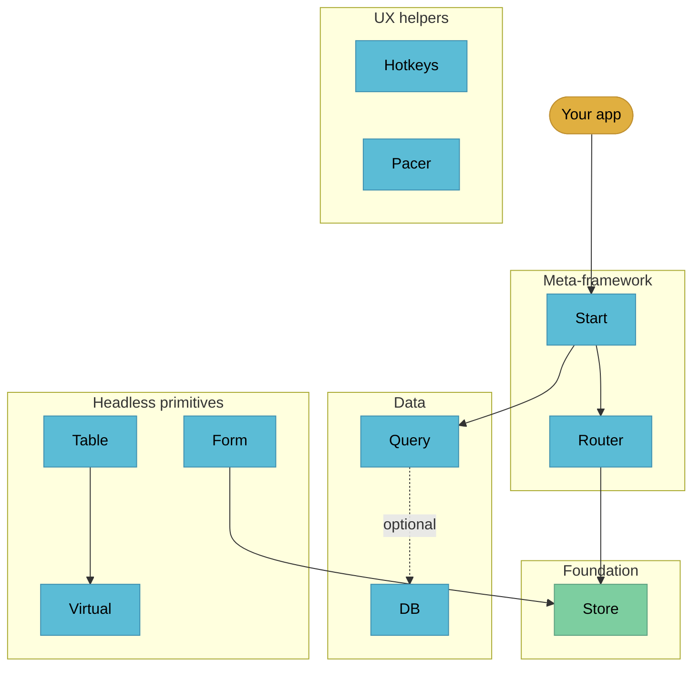

# TanStack catalogue

Verified at 2026-05-01 from `vaults/llm-wiki-research/wiki/concepts/tanstack-libraries.md` and `tanstack-scaffolder-integrations.md`. Source of truth for any "should I adopt TanStack X" question. Lift verdicts from here rather than guessing from training data; TanStack ships in alpha and beta openly and statuses move.

## Catalogue index

| Library | What it is | Status (2026-05-01) | Verdict |
|---|---|---|---|
| **Start** | Type-safe full-stack meta-framework, file routes + server fns | RC | **In canon, default** |
| **Router** | Type-safe file-based routing, search-param schemas | Stable | **In canon** (under Start) |
| **Query** | Server-state cache, framework agnostic | Stable | **In canon, default** for server state |
| **Form** | Headless type-safe form state, no schema-coupling | Stable (newly graduated) | **Use today** for any non-trivial form |
| **Table** | Headless data-grid primitives | Stable | **In canon** for app-internal tables |
| **Virtual** | Windowing for huge lists / grids | Stable | **Use today** for any list past 1K rows |
| **Store** | Tiny framework-agnostic reactive store | Alpha (mature; powers Form + Router) | **Use today** for global state |
| **DB** | Reactive client-store layered over your existing API | Beta | **Worth investigating** (sits between Drizzle and Convex) |
| **AI** | Vercel-AI-SDK competitor, multi-provider | Alpha | **Wait** (Vercel AI SDK is more mature today) |
| **Pacer** | Debounce / throttle / rate-limit / queue / batch | Beta | **Use today** for any rate-limited UI |
| **Hotkeys** | Type-safe shortcuts + sequences + recording | Alpha | **Wait for beta** unless you need recording |
| **Intent** | Ship Agent Skills (procedural knowledge) with npm packages | Alpha | **Frontier** (paradigm-shift potential for skill distribution) |
| **CLI** | Scaffolder + MCP server for TanStack docs | Alpha | **Use today** for new TanStack apps |
| **Devtools** | Standalone debugging surface across Query / Router / Store | Alpha | **Use in dev** as adopted libraries mature |

## When to use each (one-liners)

- **Start** — default web framework for any new app. See `/ro:new-tanstack-app`.
- **Router** — never used directly in our stack; lives under Start.
- **Query** — any time the client fetches from a server. The default for non-trivial server state.
- **Form** — any form past three fields, especially with multi-step flows or dynamic schemas.
- **Table** — app-internal tables where you control markup and want sorting / filtering / virtualisation hooks.
- **Virtual** — any list or grid past about 1K rows. Drop-in for tables, feeds, search results.
- **Store** — framework-agnostic reactive global state. Pick over Zustand if you want the foundation TanStack itself uses.
- **DB** — reactive client store over your existing API. Adopt when optimistic mutations + live queries justify a beta dep, and Convex's lock-in is unacceptable.
- **AI** — wait. Use Vercel AI SDK today.
- **Pacer** — search-as-you-type, autosave, rate-limited polls, scroll-driven loads. Anywhere a debounce or throttle goes.
- **Hotkeys** — power-user surfaces with chord shortcuts (`g d` for go-to-dashboard) or user-rebindable keys.
- **Intent** — track only. When `/ro:nango` could one day live inside `@nangohq/node` itself, this is why.
- **CLI** — `pnpm dlx create-tsrouter-app` for greenfield. The MCP-server-for-docs angle is the watch-this part.
- **Devtools** — drop in once Query and Router are wired; see request waterfalls, route trees, store snapshots.

## TanStack vs alternatives

| Library | Most-people alternative | When the alternative wins |
|---|---|---|
| Query | SWR | Smaller bundle, simpler API, fine for trivial fetches |
| Table | AG Grid | Pivoting, master-detail, server-side row models, integrated charts (and you do not want to build them) |
| Form | react-hook-form | More mature, more StackOverflow answers, larger community |
| Virtual | react-window | Smaller surface, you only need basic windowing |
| Store | Zustand | Simpler API, larger community, you do not need framework-agnostic |
| Router | React Router | Industry default, the team already knows it |
| DB | Convex (full backend), Drizzle (server ORM) | Convex when you want a full reactive backend; Drizzle when you only need server-side SQL. DB sits in between as a client-only sync layer |
| AI | Vercel AI SDK | Today, almost always; AI is alpha |
| Pacer | lodash.throttle, p-throttle | Trivial cases where you want one function, not a library |
| Hotkeys | react-hotkeys-hook, tinykeys | Stable, well-documented; you do not need recording |

## Composition

Store is the foundation; Form and Router depend on it internally. Start sits on Router and bundles server functions. Query is the primary data primitive most apps reach for first; DB is an optional reactive layer one level up that wraps Query collections with optimistic mutations. Form, Table, Virtual are headless primitives composed into UI. Hotkeys and Pacer are cross-cutting UX helpers. CLI, Devtools, Intent, AI are the tooling layer; Intent and AI are still settling.

## When to NOT reach for TanStack

- **Form vs react-hook-form** is a coin flip. RHF has more answers on StackOverflow and the community is larger; pick it if the team already knows it.
- **Store vs Zustand** is similarly close. Zustand is simpler; pick it if you do not need framework-agnostic.
- **Router vs React Router** — if the team has years of React Router muscle memory and search-param type-safety is not the killer feature, do not migrate.
- **AI vs Vercel AI SDK** — TanStack AI is alpha; Vercel AI SDK is the production pick today.
- **Hotkeys** — react-hotkeys-hook is fine for simple shortcuts. Only reach for TanStack Hotkeys when you need sequences (`g d`) or user-rebinding.

TanStack is not always the right call. Pick on merit per library, not on brand affinity.

## Frontier picks worth tracking

### TanStack Pacer (adopt today)

Beta. Debounce, throttle, rate-limit, queue, batch with sync and async variants, type-safe, framework-agnostic, reactive React adapters. Sounds trivial; writing a correct async-debounce is harder than people think. Drop into any rate-limited UI: search-as-you-type, autosave, scroll-driven loads. Today is the right time.

### TanStack DB (worth investigating)

Beta. Reactive client-side store layered over your existing API. Collections, live queries, optimistic mutations. Sits between Drizzle (server SQL) and Convex (full backend). Lets you keep D1 + Drizzle on the server and add optimistic-mutation feel on the client without paying the Convex lock-in tax. Worth a real test on the next greenfield app where the UX wants to feel real-time but the backend stays normal HTTP.

### TanStack Intent (track only)

Alpha. Library maintainers ship Agent Skills inside npm packages, version-aligned, auto-discovered when you `pnpm add` the package. Same shape as our `/ro:*` skills, but distributed via npm. Paradigm-shift potential: `/ro:nango` could one day live inside `@nangohq/node` itself, maintained by Nango. Subscribe to TanStack newsletter and watch for first non-TanStack libraries shipping Intent skills.

## See also

- `/ro:new-tanstack-app` to scaffold a new app on TanStack Start
- `/ro:migrate-to-tanstack` to port an existing app onto TanStack Start
- `/ro:clerk`, `/ro:nango`, `/ro:stripe`, `/ro:cf-ship` for the rest of the canonical stack
- Research deep-dives:
  - `llm-wiki-research/wiki/concepts/tanstack-libraries.md` (full catalogue with composition diagram)
  - `llm-wiki-research/wiki/concepts/tanstack-scaffolder-integrations.md` (Tanner's vendor picks + "things you haven't thought about" curation)
- TanStack docs: https://tanstack.com/
